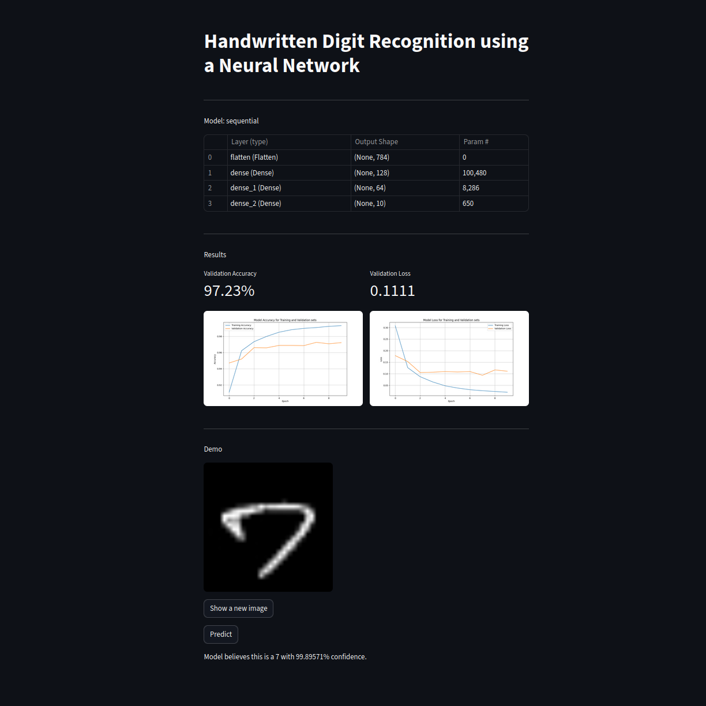

# Handwritten Digit Recognition using a Neural Network

This project implements a neural network to recognize handwritten digits (0-9). I used Streamlit to display the model's results and allow users to test the model on random images from an unseen dataset.



## Datasets

Datasets obtained from [GeeksforGeeks](https://www.geeksforgeeks.org/).

## Installation

```bash
git clone https://github.com/mdesan/Handwritten-Digit-Recognition.git
```

**Note**: The model is pre-trained. Run Main.py to retrain model which overwrites the relevant files(optional).

Run
```bash
streamlit run Gui.py
```
to open GUI in browser.
